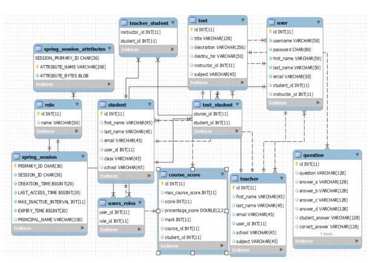
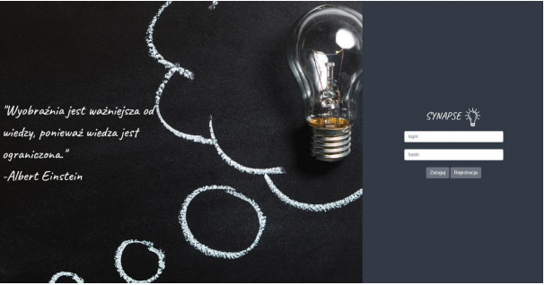
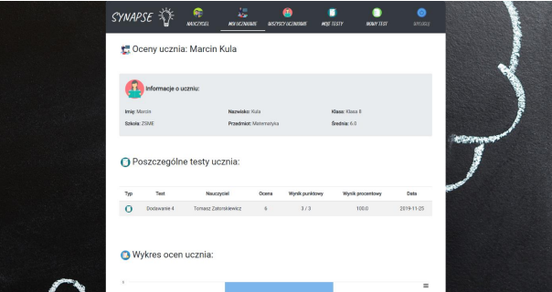
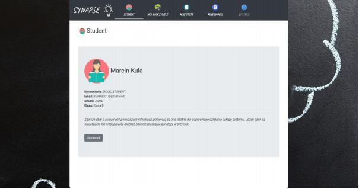
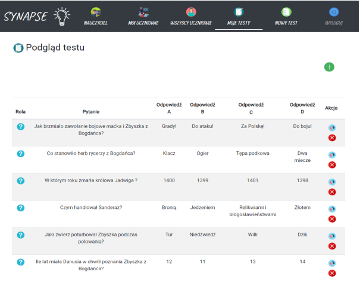
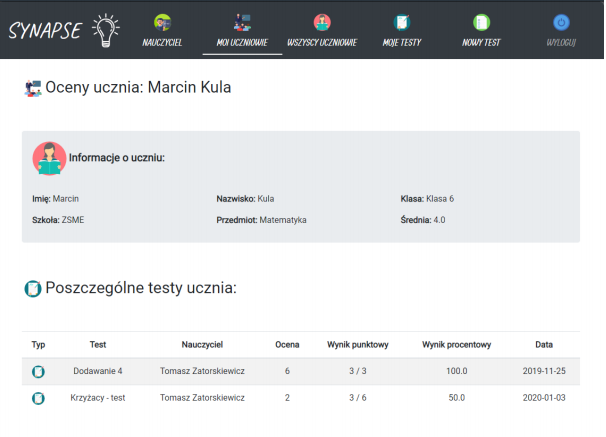
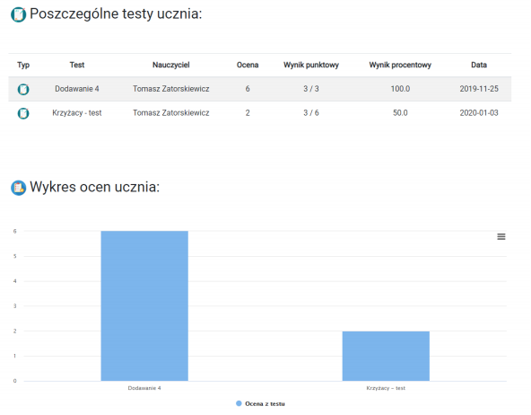

# Synapse

 
 
 

<b>What is Synapse?</b>

Synapse is educational support platform teaching a chosen subject at any level of education. Allows you to create two types of accounts: teacher and student. The teacher can create new tests and manage existing tests, analyze test results and manage his students. The student can solve tests provided by teachers and analyze their results. 

 
 

<b>Database</b>

A MySQL database contains 12 tables that are linked to each other by a relationship. Files with the structure of each table are located in the sql-scripts folder. CRUD operations are provided by <b><i>JpaRepository</b></i>. The user's password is hashed using <b><i>BCrypt</b></i>. Below is the database schema generated by MySQL Workbench:  

 

 
 

<b>Dependencies</b>

The application uses <b><i>maven</b></i> to manage dependencies, which is why all required dependencies are in the <b>pom.xml</b> file.

 
 

<b>Spring Security</b>

Synapse uses <b><i>Spring Security</i></b> to manage application security. The <b>SecurityConfig</b> class defines the user authentication method, login and registration process, role management, and BCrypt encoding settings. The <b>CustomAuthenticationSuccessHandler</b> class authenticates the login process.

 
 

<b>Server</b>

By default, the application uses the embedded <b>Tomcat</b> server, which is provided by the <b><i>spring-boot-starter-web</b></i> dependency, so you don't need an external server.

 
 

<b>Template engine, styles and pictures</b>

Synapse uses <b><i>Thymeleaf</b></i> to manage templates. All images were downloaded from <a href="https://www.flaticon.com/home">flaticon</a>. <b><i>Bootstrap</b></i> was used to style the application. Below are several screenshots presenting the appearance of the application:

 
 

 

 

 

 

 

